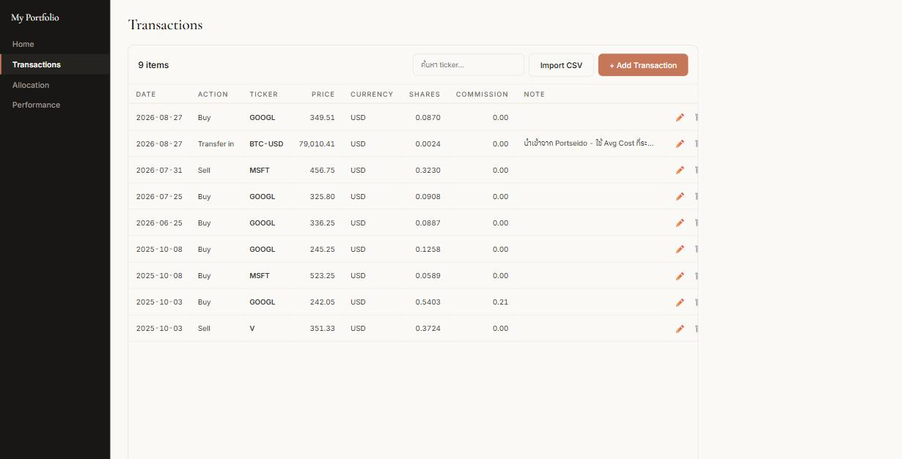
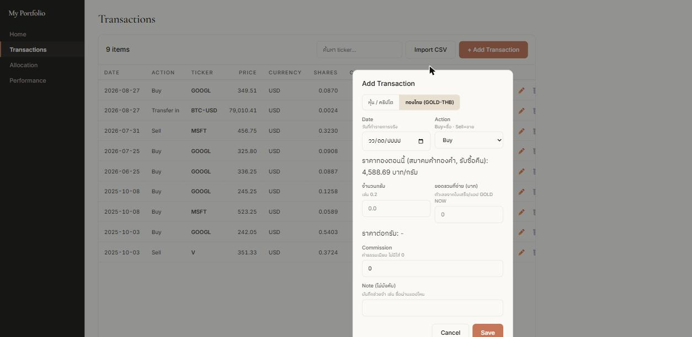
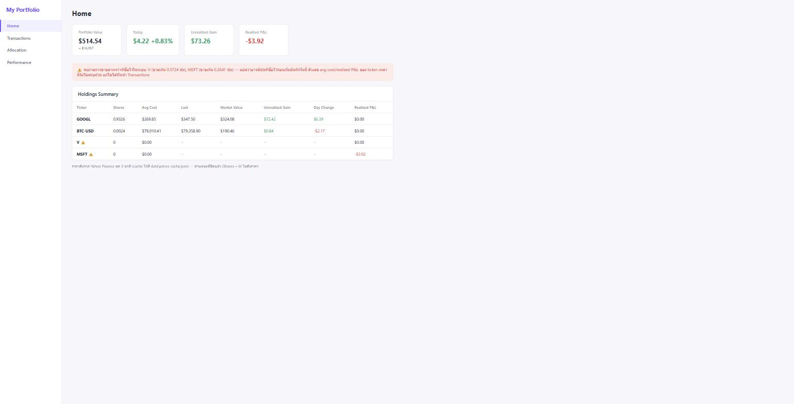
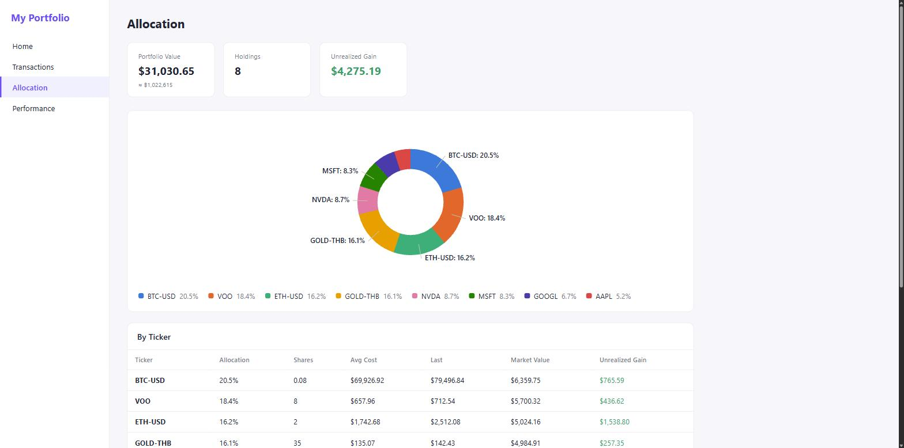
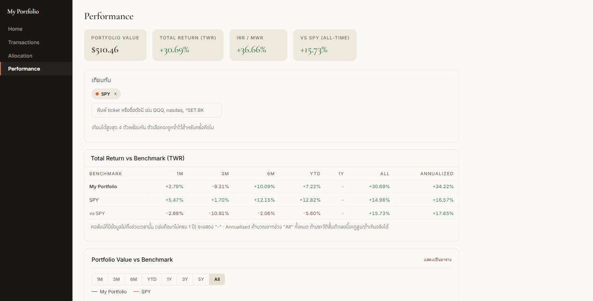

# My Portfolio

เว็บพอร์ตส่วนตัว Node server เปล่า (ไม่มี dependency ภายนอกเลย) + HTML/JS ธรรมดา ไม่มี framework ไม่มี build step ฐานข้อมูลคือไฟล์ `data/transactions.csv` ที่เปิดด้วย Excel ได้ตรงๆ

รองรับทั้ง **หุ้น/ETF/คริปโต** (ดึงราคาจาก Yahoo Finance) และ **ทองคำไทย** (ราคาสมาคมค้าทองคำ กรอกเป็นกรัม) ในพอร์ตเดียวกัน พร้อมแปลงสกุลเงินให้อัตโนมัติ

> ภาพหน้าจอทั้งหมดด้านล่างใช้ **ข้อมูลตัวอย่าง** ไม่ใช่พอร์ตจริง

## วิธีรัน

ต้องมี [Node.js](https://nodejs.org/) ติดตั้งไว้ก่อน (ไม่ต้องรัน `npm install` เพราะไม่มี dependency)

```
ดับเบิลคลิก start.bat
```

เปิด `http://127.0.0.1:8787/` ให้อัตโนมัติ ครั้งแรกจะเป็นพอร์ตว่างเปล่า (ไฟล์ข้อมูลจริงถูก gitignore ไว้ ไม่ได้อยู่ใน repo) กด **+ Add Transaction** เพื่อเริ่มบันทึกรายการแรก

---

## หน้า Transactions — บันทึกธุรกรรม



หน้าหลักที่ใช้กรอกข้อมูล ทุกอย่างเริ่มจากที่นี่ ตารางเลื่อนในตัวเองพร้อมหัวตารางติดบน ปุ่ม ✏️ แก้ไข / 🗑️ ลบ อยู่ขวาสุดของแต่ละแถว มีช่องค้นหา ticker ด้านบน

**การเพิ่มรายการ** กด **+ Add Transaction** แล้วเลือกแท็บตามประเภทสินทรัพย์:



**แท็บ "หุ้น / คริปโต"**
1. **Date** — วันที่ทำรายการจริง ไม่ใช่วันที่กรอก (ระบบใช้อัตราแลกเปลี่ยนของวันนั้นในการคำนวณ)
2. **Ticker** — พิมพ์ชื่อย่อหรือชื่อบริษัทก็ได้ (เช่น พิมพ์ `alphabet` เจอ `GOOGL`) แล้วเลือกจากรายการที่เด้งขึ้นมา ตัวที่มีในพอร์ตอยู่แล้วจะมีป้าย "ในพอร์ต" กำกับ
3. **Price** — ราคาต่อ 1 หน่วย **ไม่ใช่ยอดรวม** — ถ้าจำราคาไม่ได้ กดปุ่ม *"ดึงราคาปิดของวันที่เลือก"* ให้ดึงมาให้ (ถ้าวันนั้นตลาดปิดจะถอยไปใช้วันทำการก่อนหน้าให้เอง และบอกกำกับว่าเป็นค่าประมาณ)
4. **Shares** — จำนวนหน่วย ใส่เศษหน่วยได้ (เช่น `0.0589`)
5. **ยอดรวมที่จ่าย** *(ไม่บังคับ)* — ถ้ารู้แค่ว่าจ่ายไปเท่าไหร่ กรอกช่องนี้แทน ระบบจะหารเป็นราคาต่อหน่วยให้เอง

**แท็บ "ทองไทย (GOLD-THB)"** — ตัดช่อง Ticker/Currency ออกให้เลย เหลือแค่ 2 ช่อง
1. **จำนวนกรัม** — ตามที่แอปทองแสดง (เช่น `0.2`)
2. **ยอดรวมที่จ่าย (บาท)** — ตัวเลขจากใบเสร็จ

ระบบคำนวณราคาต่อกรัมให้อัตโนมัติ และแสดงราคาทองปัจจุบันไว้ด้านบนให้เทียบ

**Import CSV** — นำเข้าทีละหลายรายการได้ รองรับชื่อหัวคอลัมน์หลายแบบ (`shares`/`qty`/`quantity`, `commission`/`fee`) มีหน้าตัวอย่างให้ตรวจก่อนยืนยัน และติ๊กรายการที่ซ้ำกับของเดิมออกให้อัตโนมัติ

---

## หน้า Home — ภาพรวมพอร์ต



ดูสถานะพอร์ตรวมทั้งหมด ตัวเลข 4 ช่องบนสุด: **Portfolio Value** (มูลค่ารวม + แปลงเป็นบาทให้ด้วย), **Today** (กำไร/ขาดทุนวันนี้), **Unrealized Gain** (กำไรที่ยังไม่ได้ขาย), **Realized P&L** (กำไรที่ขายรับรู้แล้ว)

ตารางด้านล่างแยกตาม ticker พร้อม Avg Cost, ราคาล่าสุด, มูลค่าตลาด — ราคาดึงสดจาก Yahoo Finance (cache 5 นาที)

**สัญลักษณ์ที่อาจเจอ**
- ⚠️ ท้ายชื่อ ticker = มีรายการขายมากกว่าที่ซื้อไว้ในระบบ (น่าจะซื้อไว้ก่อนเริ่มบันทึก) ตัวเลข avg cost ของตัวนั้นจึงไม่ครบ
- `N/A` = ดึงราคาไม่ได้ชั่วคราว, `-` = ปิดโพซิชันไปแล้ว (ถือ 0 หน่วย)

**ข่าวหุ้นที่ถือ** — rail ทางขวา ดึงข่าวจาก Yahoo Finance เฉพาะ ticker ที่ยังถืออยู่จริง (สูงสุด 8 ticker) สลับกันแสดงเท่าๆ กันทุก ticker ไม่ให้ตัวที่มีข่าวถี่ (เช่นคริปโตที่เทรด 24/7) แย่งพื้นที่ตัวที่ถือมูลค่าเยอะกว่าแต่ข่าวออกน้อยกว่า ข่าวเดียวกันที่เกี่ยวกับหลาย ticker จะรวมเป็นแถวเดียว กด badge ticker เพื่อดูว่าเกี่ยวกับตัวไหนบ้าง คลิกหัวข้อเพื่อเปิดอ่านที่ Yahoo Finance ในแท็บใหม่ (cache ไว้ 6 ชั่วโมง)

---

## หน้า Allocation — สัดส่วนการลงทุน



ดูว่าเงินกระจายอยู่ที่ไหนบ้าง โดนัทแสดงสัดส่วนตามมูลค่าตลาดปัจจุบัน (ไม่ใช่ตามเงินที่ลงไป) แสดงเฉพาะโพซิชันที่ยังถืออยู่ ตัวที่ปิดไปแล้วดูได้ที่หน้า Home

ถ้ามี ticker ที่ดึงราคาไม่ได้ จะมีข้อความบอกว่าไม่ได้รวมตัวไหนในกราฟ แต่ยังเห็นในตารางด้านล่าง

---

## หน้า Performance — ผลตอบแทน



วัดผลตอบแทนจริงเทียบกับ benchmark ที่เลือกเอง

- **เลือก benchmark** — ช่อง "เทียบกับ" พิมพ์ ticker หรือชื่อดัชนีอะไรก็ได้ (เช่น `QQQ`, `nasdaq`, `^SET.BK`) เลือกได้พร้อมกันสูงสุด 4 ตัว แต่ละตัวเป็น chip ที่กดปุ่ม × เพื่อเอาออกได้ ค่าเริ่มต้นคือ S&P500 (`SPY`) และระบบจะจำตัวเลือกไว้ในเบราว์เซอร์ (localStorage) เปิดเข้ามาครั้งหน้ายังเป็นชุดเดิม
- **TWR (Time-Weighted Return)** — ผลตอบแทนของการลงทุนล้วนๆ ไม่รวมผลจากจังหวะเติม/ถอนเงิน ใช้เทียบกับดัชนีได้ตรงๆ ไม่ขึ้นกับว่าเลือก benchmark ตัวไหนอยู่
- **IRR / MWR** — ผลตอบแทนจริงของเงินคุณ รวมผลจังหวะเข้าออกด้วย
- **กราฟ** — เทียบมูลค่าพอร์ตกับ "ถ้าเอาเงินก้อนเดียวกันไปลง benchmark แทน" วาดได้พร้อมกันหลายเส้นตามจำนวน benchmark ที่เลือก เลือกช่วงเวลาได้ (1M/3M/6M/YTD/1Y/3Y/5Y/All) เอาเมาส์ชี้ดูตัวเลขรายวันได้ กดลิงก์ *"แสดงเป็นตาราง"* ถ้าอยากดูเป็นตัวเลข
- **Historical Return** — ตารางผลตอบแทนแยกรายเดือน/ไตรมาส/ปี ไล่สีเขียว-แดงตามกำไรขาดทุน คอลัมน์จะเพิ่มขึ้นตามจำนวน benchmark ที่เลือก

---

## เทคสแตก

Node.js `http` module ล้วนๆ (static file server + REST API ไม่มี Express) ฝั่ง client เป็น vanilla JS แบบ IIFE namespace ต่อไฟล์ ไม่มี React/Vue ไม่มี bundler

ราคาดึงจากฝั่ง server ทั้งหมดเพื่อเลี่ยง CORS และไม่ต้องใช้ API key เลย — [Yahoo Finance](https://finance.yahoo.com/) (ราคาหุ้น/คริปโต + ประวัติย้อนหลัง), [frankfurter.dev](https://frankfurter.dev/) (อัตราแลกเปลี่ยน ทั้งปัจจุบันและย้อนหลัง), [thai-gold-api](https://github.com/max180643/thai-gold-api) (ราคาทองคำไทย)

รายละเอียดการพัฒนา บั๊กที่เจอและแก้ไป และข้อจำกัดที่รู้อยู่แล้ว — ดูที่ [PROGRESS.md](PROGRESS.md)

---

## อัปเดต

**30 ส.ค. 2026**
- **หน้า Performance เลือก benchmark เองได้** — จากเดิมที่ตรึงไว้เป็น S&P500 ตัวเดียว ตอนนี้พิมพ์ ticker หรือชื่อดัชนีอะไรก็ได้ เลือกพร้อมกันได้สูงสุด 4 ตัว และจำตัวเลือกไว้ให้ กราฟ/ตาราง/heatmap ขยายตามจำนวนที่เลือกอัตโนมัติ
- **หน้า Home มี rail ข่าวหุ้นที่ถือ** — ดึงข่าวจาก Yahoo Finance เฉพาะ ticker ที่ยังถืออยู่ สลับแสดงเท่าๆ กันทุกตัว กรองข่าวที่เก่าเกิน 30 วันออก

**28 ส.ค. 2026**
- เผยแพร่เวอร์ชันแรกบน GitHub — ครบ 4 หน้า (Transactions / Home / Allocation / Performance) รองรับหุ้น/ETF/คริปโต และทองคำไทยในพอร์ตเดียวกัน แปลงสกุลเงินอัตโนมัติ คำนวณ TWR และ IRR/MWR เอง พร้อม import CSV และ autocomplete ช่อง ticker
